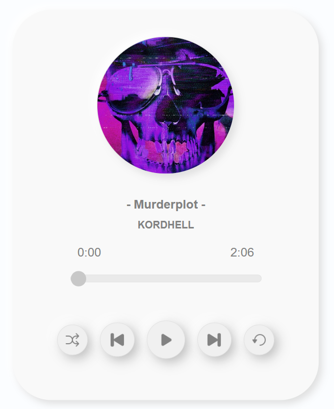

### Simple-MusicPlayer

<br>

Simple music player that runs on the web.

<br>


---

### Build a Playlist

You can create your own favorite playlists.  
Add music based on the template to songsInfo in [music.js](https://github.com/Sakamochanq/Simple-MusicPlayer/blob/master/assets/music.js#L23C1-L30C3).

```js
const songsInfo = [
    {
        src: './assets/pop/songs/Murderplot.mp3',
        albumImage: './assets/pop/albums/Murderplot.png',
        musicName: '- Murderplot -',
        artistName: 'KORDHELL'
    },
];
```

## Screenie

<a href="#">    
    
</a>

<br>

[Simple-MusicPlayer](https://sakamochanq.github.io/Simple-MusicPlayer)

## Installation

Repository Clone
```bash
git clone https://github.com/Sakamochanq/Simple-MusicPlayer.git
```

Change Directory
```bash
cd Simple-MusicPlayer
```
